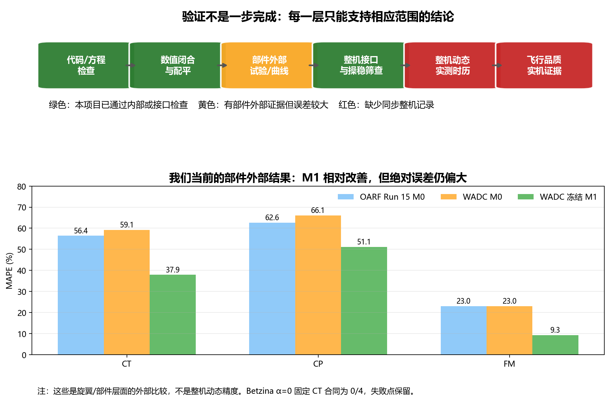

# 倾转旋翼模型验证：国内外做法与本项目结果（简明版）

调研与审计日期：2026-09-12

## 先看结论

国内外都有通用或“XV-15-like”倾转旋翼模型。它们通常不是拿到一个完整的 HeliUM 模型，而是依据公开报告、经典气动方程、自有样机参数和试验数据自行重建。

验证也不是一步完成，而是分层进行：

```text
代码/方程检查 → 数值闭合 → 旋翼或部件试验 → 整机配平/导数 → 动态飞行时历 → 飞行品质
      已完成          已完成          部分完成             已完成(条件性)       当前缺数据       当前不能声明
```

最关键的区别是：模型能运行、趋势合理、与同源数值模型一致，都不能代替整机动态实测验证。



## 国内外怎样建模和验证

|研究路线|模型从哪里来|怎样验证|能证明什么|不能直接证明什么|
|---|---|---|---|---|
|NASA/GTRS、NDARC XV-15 路线|XV-15 公开几何、气动、操纵和试验报告；自行整理成模型|配平曲线、性能曲线、公开飞行数据和风洞资料|特定构型、工况下的性能和配平一致性|没有同步输入和状态时，不能证明全过程动态误差|
|国内 XV-15-like 过渡走廊路线|Ferguson NASA CR-166536/166537、TM-81177、TM-81244 等公开资料重建|配平、功率、失速和过渡走廊仿真；部分公开曲线对照|模型可用于走廊和控制研究|不能把自建模型称为 HeliUM，也不能自动获得实机飞行品质资格|
|国内小型倾转旋翼路线|自有样机几何、质量、电机/桨参数，气动常来自 Fluent 或试验|风墙、六分量力/矩、控制仿真|部件载荷、控制策略和模式切换趋势|不能外推到 XV-15 或大型整机动态精度|
|NASA/军方试验台路线（如 TRAST）|公开的缩比旋翼/短舱/结构参数|地面振动、模态频率、颤振边界与 RCAS/NASTRAN/CAMRAD II 对照|结构/气弹模型的模态和稳定性预测能力|不能直接替代整机飞行验证|
|本项目路线|通用核心 + 独立 XV-15 验证适配层|内部闭合、OARF/WADC/Betzina 部件证据、整机接口和过渡包络|限定任务内的低成本数值预测、误差边界和失效机制|目前不能证明全机动态精度、实机飞行品质或国内领先|

## 我们实际做到了什么

|层级|本项目证据|结果|简单解释|
|---|---|---|---|
|代码和方程|MATLAB R2021a 完整回归|`ALLCHECKS_FINAL_B145224=1`|接口、单位、左右旋翼、力矩、配平和线性化没有发现新的内部错误|
|动态入流基线|Pitt–Peters 三状态，5/5 测试通过|通过|作为成熟方法基线存在，但当前没有冒称已经接入 Berger13 生产接口|
|过渡数值能力|速度—短舱角包络，6/6 检查通过|通过|可以生成条件性数值过渡包络，不等于飞行走廊验证|
|旋翼部件外部比较|NASA OARF Run 15|CT/CP/FM MAPE = 56.42/62.61/23.02%|模型能算出结果，但绝对误差仍大，失败被保留|
|旋翼部件外部比较|NASA OARF Run 14|CT/CP/FM MAPE = 56.19/64.08/19.12%|与 Run 15 同一系列，不能当成完全独立来源|
|跨设施强基线|NASA WADC M0→冻结 M1|59.15/66.10/23.05% → 37.90/51.11/9.26%|来源约束改进了相对误差，但绝对 CT/CP 仍偏大|
|整机接口|13 状态/10 输入、统一 CG、短舱反力矩、变量惯量|通过内部检查|证明接口和数值链能运行，不等于真实飞机已经验证|
|全机动态|同步实际输入—载荷—状态时历|缺失|这是目前唯一真正阻断全机动态精度和实机飞行品质的层级|

## 缺少的信息能不能解决

能解决，但不能靠继续猜参数解决。可行的补充有三类：

1. **公开部件数据**：旋翼六分量载荷、动态总距响应、旋翼/机翼干扰试验。它们能继续提高部件级可信度。
2. **高保真参考数据**：同构型 CFD、自由尾迹或经过授权的仿真数据库。它们能检验模型形式，但仍要说明是数值参考，不是实测。
3. **同步整机记录**：实际受载总距或执行器位置、短舱角、转速、旋翼载荷、姿态/角速率、速度/高度、质量/重心/惯量和统一时间基准。只有这类数据能把整机动态误差和输入误差分开。

因此，缺少 HeliUM 本身不是致命问题；缺少与模型输入输出同构的独立数据，才是全机声明的真正阻断。

## 对论文和“国内领先”的直白判断

- **航空学报候选稿**：可以按“公开资料约束下的低成本整机模型、部件外部检查和条件性过渡分析”投稿评估。
- **整机操稳计算**：可以做模型级配平、导数、模态和操稳筛查；不能写成实机飞行品质认证。
- **国内领先**：现在不能声明。必须先固定任务、输入、输出、数据集和计算预算，再与真正适用的国内强方法做独立对比。

## 主要公开来源

- NASA CR-2017-219456，XV-15 的 NDARC/GTRS 性能与公开试验数据对照：<https://ntrs.nasa.gov/api/citations/20190001251/downloads/20190001251.pdf>
- NASA CR-166536A，实时飞行数学模型结构：<https://rotorcraft.arc.nasa.gov/Publications/files/CR-166536_882.pdf>
- 国内《加/减速状态下倾转旋翼飞行器动态过渡走廊》：<https://hkxb.buaa.edu.cn/CN/10.7527/S1000-6893.2025.31377>
- 国内《倾转旋翼机风洞试验综述》：<https://hkxb.buaa.edu.cn/CN/10.7527/S1000-6893.2024.30114>
- 美国公开 TRAST 试验与建模数据：<https://arl.devcom.army.mil/arlreport/arl-tr-10030/>

## 可复算入口

- GitHub：<https://github.com/x162645/tiltrotor-general-validation>
- [候选论文](航空学报候选论文_最新审计版_20260912.md)
- [研究完成清单](研究闭环完成清单_20260912.md)
- [论文复算入口](论文复算入口_20260912.md)
